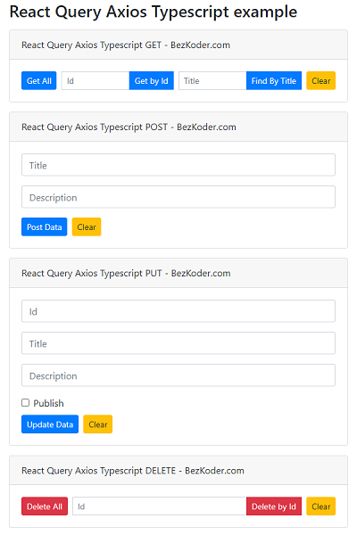

# React Query with Axios and Typescript example

React Client with React Query and Axios (Typescript) to make CRUD requests to Rest API in that:

- React Query Axios Typescript GET request: get all Tutorials, get Tutorial by Id, find Tutorial by title
- React Query Axios Typescript POST request: create new Tutorial
- React Query Axios Typescript PUT request: update an existing Tutorial
- React Query Axios Typescript DELETE request: delete a Tutorial, delete all Tutorials

For instruction, please visit:
> [React Query Axios (Typescript) - Get/Post/Put/Delete example with Rest API](https://www.bezkoder.com/react-query-axios-typescript/)

Related Posts:
> [React Hooks Typescript example Project with Axios and Web API](https://bezkoder.com/react-typescript-api-call/)

> [React Hook Form Typescript example with Validation](https://www.bezkoder.com/react-hook-form-typescript/)

> [React Table example: CRUD App with react-table v7](https://www.bezkoder.com/react-table-example-hooks-crud/)

> [React Hooks File Upload example](https://bezkoder.com/react-hooks-file-upload/)

> [React Hooks: JWT Authentication & Authorization example](https://bezkoder.com/react-hooks-jwt-auth/)

> [React + Redux + Hooks: JWT Authentication & Authorization example](https://bezkoder.com/react-hooks-redux-login-registration-example/)

Fullstack with Node Express:

> [React + Node Express + MySQL](https://www.bezkoder.com/react-node-express-mysql/)

> [React + Node Express + PostgreSQL](https://www.bezkoder.com/react-node-express-postgresql/)

> [React + Node Express + MongoDB](https://www.bezkoder.com/react-node-express-mongodb-mern-stack/)

Fullstack with Spring Boot:

> [React + Spring Boot + MySQL](https://www.bezkoder.com/react-spring-boot-crud/)

> [React + Spring Boot + PostgreSQL](https://www.bezkoder.com/spring-boot-react-postgresql/)

> [React + Spring Boot + MongoDB](https://www.bezkoder.com/react-spring-boot-mongodb/)

Fullstack with Django:

> [React + Django Rest Framework](https://www.bezkoder.com/django-react-axios-rest-framework/)

Serverless with Firebase:

> [React Typescript Firebase example: Build CRUD App](https://www.bezkoder.com/firebase-typescript-react/)

> [React Typescript Firestore example: Build CRUD App](https://www.bezkoder.com/react-typescript-firestore/)

Integration (run back-end & front-end on same server/port)

> [How to integrate React with Spring Boot](https://www.bezkoder.com/integrate-reactjs-spring-boot/)

> [Integrate React with Node Express on same Server/Port](https://www.bezkoder.com/integrate-react-express-same-server-port/)

This project was bootstrapped with [Create React App](https://github.com/facebook/create-react-app).